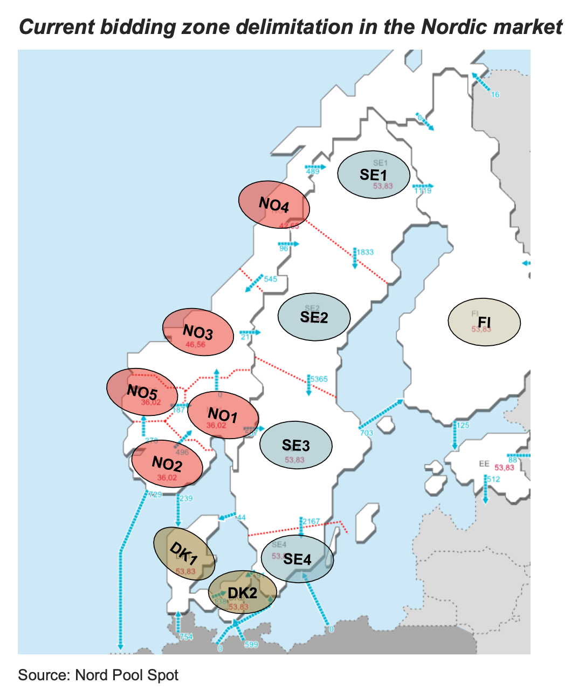
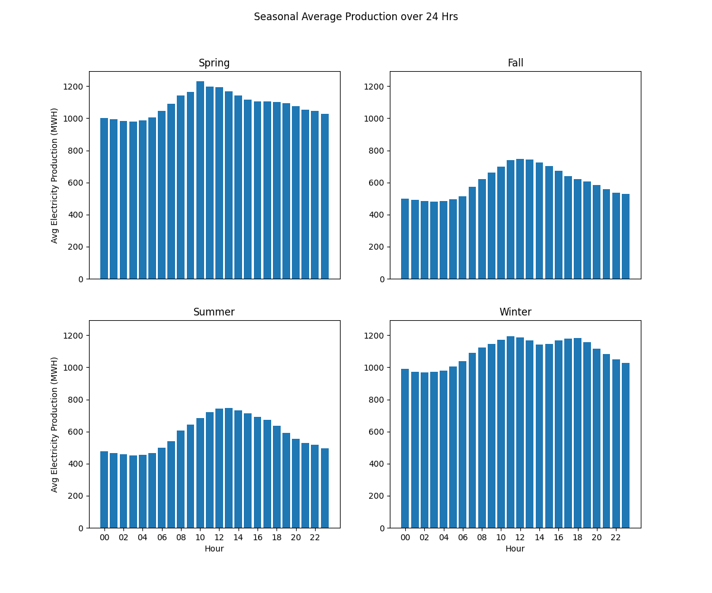
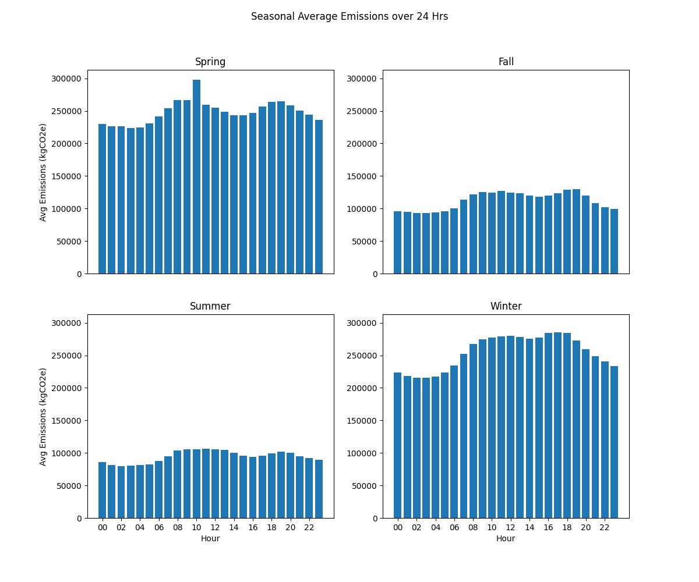
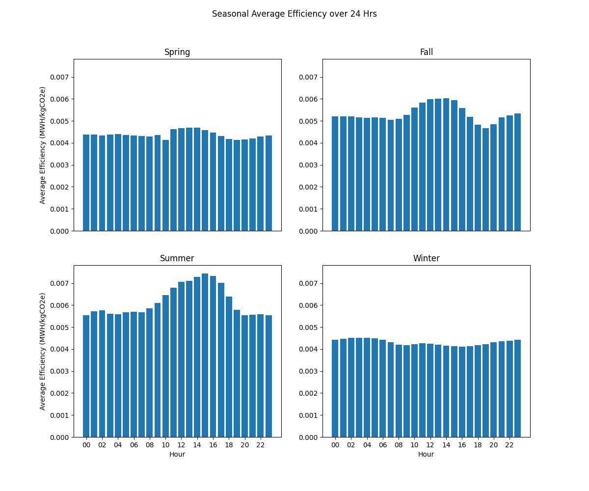
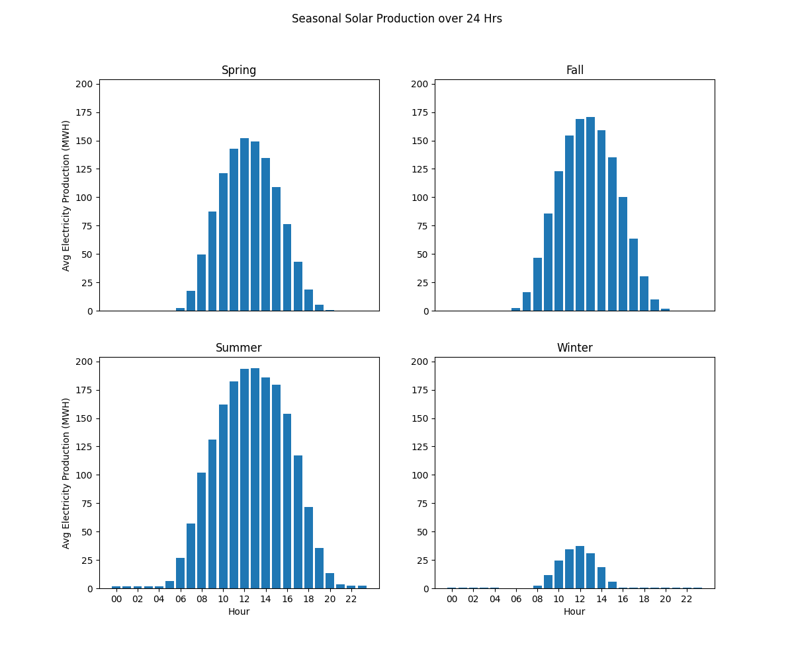
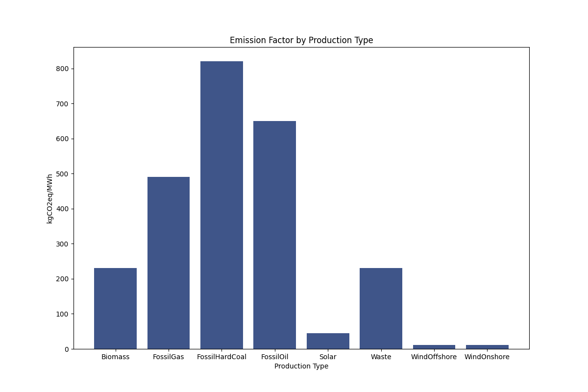
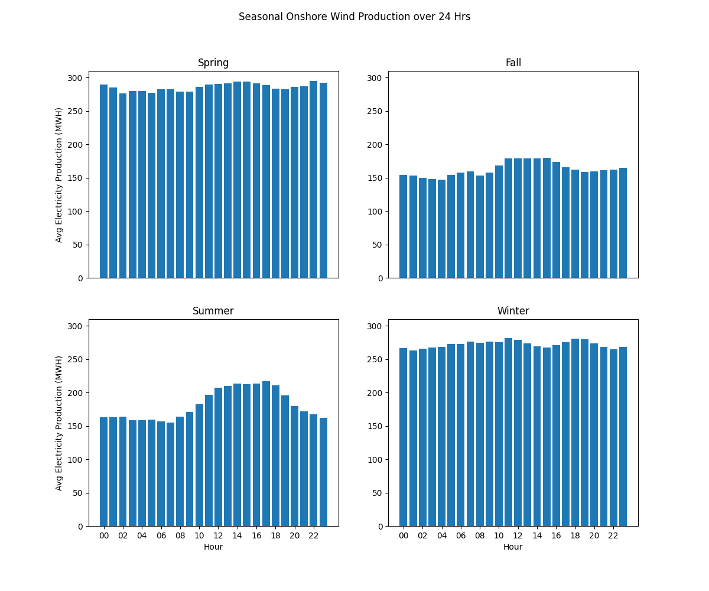
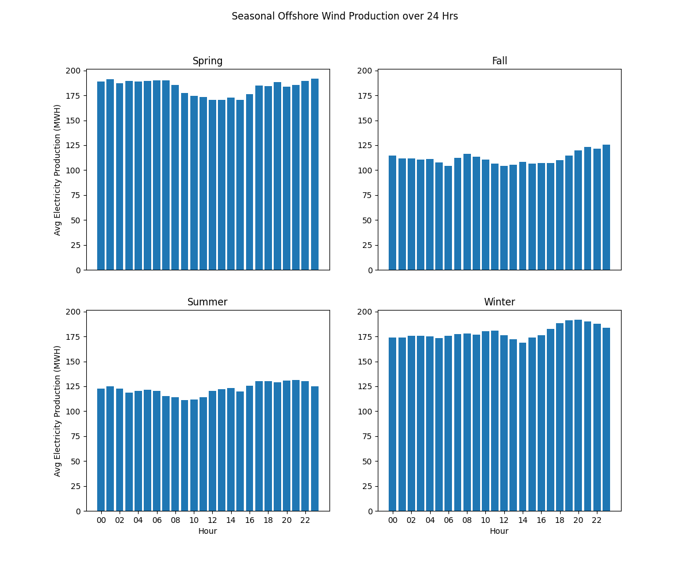
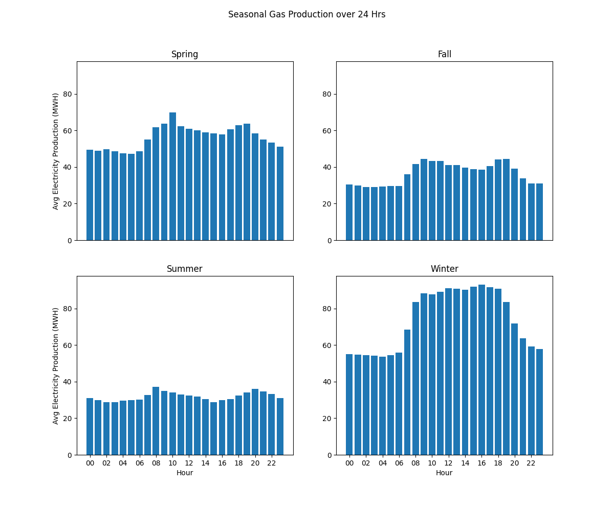
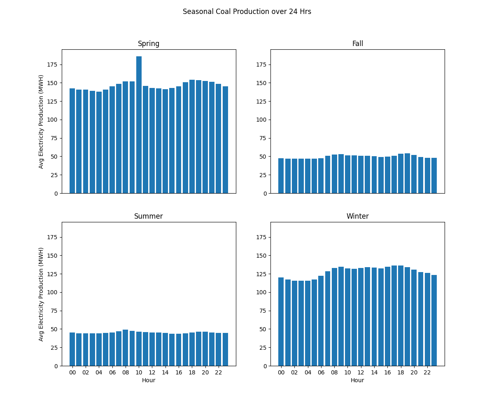

# Report for Copenhagen-based Danish EV Charging App ('Client')
We appreciate your interest in electricityMap. Even though how we accomplish our goals may not yet be clear, it is always exciting to meet another company who shares our commitment to reducing emissions from electricity. In this report, I hope to answer your questions and elucidate how we can support your "smart-charging" use case.

## Why are there two electricity zones in Denmark (East Denmark and West Denmark)?
Denmark has two electricity zones, also known as "bidding zones" - one for West Denmark (bidding zone DK1) and another for East Denmark (bidding zone DK2). This is because electricity in Denmark comes from two separate electrical grids: electricity in West Denmark comes from the Synchronous grid of Continental Europe while electricity in East Denmark comes from the Synchronous grid of Northern Europe.

#### Figure 1: Nordic Bidding Zones

This image shows the bidding zones for the Nordic market. West Denmark is bidding zone DK1 and East Denmark is bidding zone DK2.

## How much and why does the carbon footprint of electricity in Denmark change throughout the day?
When your Copenhagen-based users use electricity to charge their EVs, that electricity is being drawn from the East Denmark bidding zone. Electricity in this zone is produced using coal, gas, oil, wind, solar, and biomass production methods.

An "emission factor" represents how much Wind and solar methods have significantly lower emission factors than biomass, coal, gas, and oil. This means that production of electricity using these "greener" methods results in  including some "greener" methods of production (wind, solar, and biomass) and some methods with higher emissions (coal, gas, oil).

When describing the behavior of electricity production and usage, one factor is important to consider: seasonality. The carbon footprint of electricity during an average summer day looks extremely different from during an average winter day. During Denmark's summer, there are significantly more hours of sunlight available for solar production of electricity. Additionally, electricity consumption needs are lower because the additional sunlight offsets the need for electrical lighting. To explain the carbon footprint in Denmark, we will use the following seasonal breakdown:
- Spring = February, March, April
- Summer = May, June, July
- Fall = August, September, October
- Winter = November, December, January

Let's look at how total average electricity production (across all production types) changes over the course of 24 hours in each season. This graphs show the mean hourly aggregated electricity production for East Denmark, demonstrating what an average day looks like.

#### Figure 2: Seasonal Average Production over 24 Hrs

Electricity production peaks during the day, which makes sense - lights are on, people are working. During the spring and winter, the days are shorter and colder, so more light and heat are required, thus pumping up electricity production during those seasons.

Now let's look at the seasonal carbon footprint of this electricity production. To calculate this, we look at electricity production by production type of the course of a day, and weight each production type by its respective emission factor, thus giving us emissions by production type. We then aggregate the emissions by production type to see the total emissions over the course of a day.

#### Figure 3: Seasonal Average Emissions over 24 Hrs

An average fall or summer day has a consistenly low carbon footprint. An average spring or winter day, on the other hand, has a significantly higher carbon footprint that changes over 24 hours - the range of average emissions over 24 hours during spring and winter is consistently twice as high as in summer and fall. 

During the spring and winter, the carbon footprint actually lines up with electrical production quite well - when production spikes during the day, so does the carbon footprint. During the summer and fall, although electricity production is significantly lower overall, we still see a spike in production during the day, and yet the carbon footprint increases only slightly during that time. How is the carbon footprint kept stable as production increases during the summer and fall? Let's look at the efficiency of electricity production during the four seasons to get a better idea.

#### Figure 4: Seasonal Average Efficiency over 24 Hrs

During summer and fall, when production increases, efficiency rises to meet that production growth and sustain a low carbon footprint. How is this possible, and if the electricity grid is capable of this level of efficiency, why not always sustain it? Let's look at the production of the most efficient types of electricity production - solar, on-shore wind, and off-shore wind (see Appendix for wind production). The emission factors of these production types are significantly lower than those of gas, oil, coal, and biomass.

#### Figure 5: Seasonal Solar Production over 24 Hrs

Although average wind production over 24 hours is mostly stable, solar production can only occur during the day, so during this time, electricity production gets a huge boost of low-emission electricity.

During the summer and fall, when electricity production is quite low relative to spring and winter, the increased solar production significantly improves the efficiency of electricity production during the day. During the spring, solar production occurs but has only a small impact on efficiency because production is higher than during summer and fall. During the winter, because of how short days are, solar production is extremely low so efficiency sees no increase.

## How can we use your data to help users charge at the greenest times?
By leveraging times when electricity is being produced most efficiently, such as when solar production is at its highest, we can tell your users when they can charge their EVs with the lowest carbon footprint. We will keep your users informed ahead of time of when electricity is predicted to be "greenest", and then how green their electricity is in real time.

How will we know ahead of time how green the electricity will be? The efficiency of producing electricity varies seasonally. Each season has times when the carbon footprint of producing electricity is at its lowest. Additionally, weather data is important to electricity production - when it is cloudy out or there is not much wind, solar and wind, two efficient electricity production methods, may be producing less electricity. By combining historical patterns with weekly, daily, and hourly weather predictions, we can give users increasingly accurate predictions of when the best times will be to charge their EVs.

We also keep track of East Denmark's real-time electricity production data. We will keep users informed regarding when efficient production methods are producing a lot of electricity, particularly when this real-time data diverges from our predictions so that users know that they are charging their EVs with the greenest electricity available.

## Appendix

#### Table 1
| Season | Range of Average Emissions over 24 Hrs | Range, Normalized by Mean Emissions |
| ----------- | ----------- | ----------- |
| Spring | 74338.68 | 0.30 |
| Summer | 26532.82 | 0.28 |
| Fall | 37128.65 | 0.33 |
| Winter | 70426.64 | 0.28 |

#### Figure 6: Emission factors for each production types:

#### Figure 7: Seasonal On-Shore Wind Production

#### Figure 8: Seasonal Off-Shore Wind Production

#### Figure 9: Seasonal Gas Production

#### Figure 10: Seasonal Coal Production
